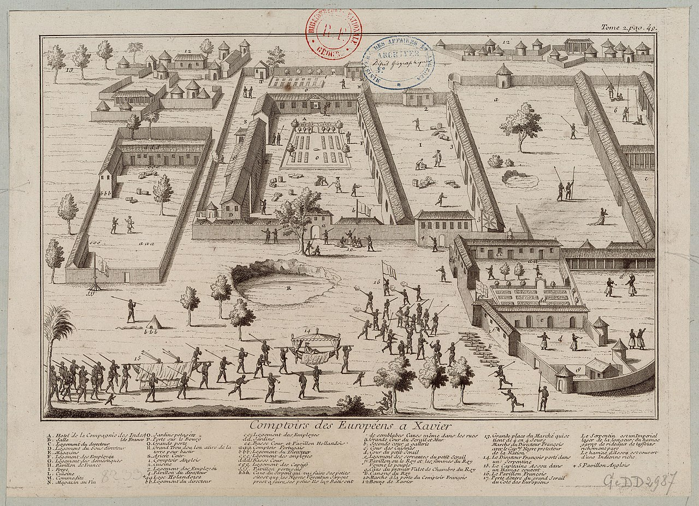

# Portrait du jour

-----

-----
## Né le 09 Septembre 1915 à Lomé, théodose est un veritable guérier de la seconde guérre mondiale

 ###  Son premier débarquement 
La réussite de Patrice Talon qui doit beaucoup au coton, seule culture nationale d’exportation, commence en 1985, avec la création de la Société de distribution internationale (SDI), qui décroche un premier marché auprès de la Société nationale pour la promotion agricole (Sonapra), la première pierre de son empire. En 1991, Nicéphore Soglo, venu de la Banque mondiale, accède à la présidence, enfant des conférences nationales et du libéralisme. Cela tombe bien! Patrice Talon n’aime pas le marxisme, le dirigisme et l’étatisme qui entravent les bonnes affaires.

En 1994, Adamou Mamadou Ndiaye, ministre de l’Agriculture du président Nicéphore Soglo et Désiré Vieira, alors ministre d’État, donnent à l’acuel lePrésident du Bénin un agrément exclusif lui permettant l’implantation de trois usines d’égrenage de coton d’une capacité de 25 000 tonnes chacune. Des engrais à l’égrenage du coton, les affaires de Patrice Talon fleurissent. L’horizon ne s’obscurcit qu’au retour de Matthieu Kérékou à la présidence en 1996. L’emprise de Patrice Talon sur la filière est alors desserrée par l’autorisation de cinq opérateurs concurrents.

### Le deuxième débarquement
Mais Patrice Talon est déjà riche et connecté avec la nouvelle étoile montante de la politique béninoise, Yahi Boni, le patron de la Banque ouest-africaine de développement (BOAD). Il finance la campagne électorale que Boni Yahi, son mentor, remporte en 2006. Ce succès est suivi d’un second mandat en 2011. C’est l’âge d’or pour notre homme d’affaires qui devient le premier investisseur privé béninois et le premier employeur privé. Il se voit confier la vérification des importations au port de Cotonou. Les tentacules de ses sociétés se posent dans plusieurs pays d’Afrique de l’Ouest, en Côte d’Ivoire, au Burkina et au Mali.

En avril 2012, Talon est visé par sept plaintes pour crimes économiques. Réfugié à Paris, il sabote les législatives de Boni Yahi en 2015 puis est élu Président l’année suivante, avec la bénédiction de la France. Il applique la réforme des finances publiques qui satisfait les institutions de Bretton Woods et la communauté internationale. Il devient, par exemple, l’un des expérimentateurs de la combinaison de la protection de la faune et de la biodiversité avec la lutte contre les groupes armés du Sahel.

Les trois royaumes d’Allada, de Porto-Novo et de Dã Homè - dans le ventre du serpent Dã (dan) - sont fondés par les Fons, qui occupent le sud du pays (le nom de Dahomey est donné à l’ensemble du pays après la conquête française). Selon la légende, la fille du roi de la ville de Tado (sur le fleuve Mono, Pays-Adja) fut fécondée par un léopard, alors qu'elle allait puiser de l'eau. Le fils qu'elle met au monde est le fondateur de toute la dynastie. Ses descendants fondent un royaume à Allada au XVIe siècle : royaume d'Ardra.

___
# prémices du Bénin

Le siècle suivant, trois frères se disputent le trône : le premier, Kopkon garde le royaume d'Allada, le deuxième, Do-Aklin (Gangnihessou) fonde Abomey et le troisième, Adjache qui devient plus tard Porto-Novo. Le royaume d'Abomey est fondé en 1625. Entre 1645 et 1685, il devient un État puissant. Le roi Aho Houegbadja, petit-fils de Do-Aklin, veut annexer un État voisin dont le roi, Dã, le défiz de s'installer sur son ventre. Dã est défait, décapité à Abomey, et dans son ventre est installé le pieu central du palais royal, signe que le roi d'Abomey a pris son adversaire au mot. 

 # Histoire de France 
  
L'histoire de la France commence avec les premières occupations humaines du territoire correspondant au pays actuel. Aux groupes présents depuis le Paléolithique et le Néolithique sont venues s'ajouter, à l'âge du bronze et à l'âge du fer, des vagues successives de Celtes, de Romains dès le IIe siècle av. J.-C, puis au IVe siècle de peuples germains (Francs, Wisigoths, Alamans, Burgondes) et au IXe siècle de Scandinaves appelés Normands.

Le nom de la France est issu d'un peuple germanique, les Francs. Clovis (466-511), roi des Francs saliens, scelle par son baptême à Reims l'alliance de la royauté franque avec l'Église catholique. Il unit les tribus franques salienne et ripuaire et conquiert un ensemble de territoires en Gaule et en Germanie qui sont agrandis par ses descendants mérovingiens, puis par la dynastie des Carolingiens fondée en 751. Charlemagne en particulier conquiert la Basse-Saxe dans le Nord de l'Allemagne, le royaume lombard en Italie, et constitue une marche à l'est qui deviendra l'Autriche. L'Empire carolingien est finalement partagé en 843 entre ses petits-fils par le traité de Verdun qui sépare la Francie occidentale de la Francie orientale, qui deviendra le royaume de Germanie. La dynastie des Capétiens s'impose définitivement en Francie occidentale à partir de 987. Philippe Auguste et ses successeurs donnent une nouvelle impulsion à l'unification territoriale du royaume de France et repoussent les frontières orientales du Rhône sur les Alpes et de la Saône sur le Rhin, à partir de l'achat du Dauphiné (1349) jusqu'à l'annexion de l'Alsace (1648-1697).

Le nom de France n'est employé de façon officielle qu'à partir de 1190 environ, quand la chancellerie du roi Philippe Auguste commence à employer le terme de rex Franciæ (roi de France)3 à la place de rex Francorum (roi des Francs) pour désigner le souverain. Le mot était déjà couramment employé pour désigner un territoire plus ou moins bien défini, comme on le voit à la lecture de la Chanson de Roland, écrite un siècle plus tôt. Dès juin 1205, le territoire est désigné dans les chartes sous le nom de regnum Franciæ, c'est-à-dire royaume de France en latin4,5. On ne peut ainsi parler d'histoire de France, au sens propre, qu'à partir du XIIe siècle6.

Les Romains étaient les premiers à unifier l'administration de la Gaule en langue latine, laquelle est devenue celle de l'Église. Le concile de Tours, réuni en 813 à l'initiative de Charlemagne, impose désormais de prononcer les homélies dans les langues vulgaires au lieu du latin. Paris, appelée à devenir la capitale par l'avènement en 987 de la dynastie capétienne, devient un centre universitaire renommé. La culture française connaît un élan nouveau au contact de la Renaissance italienne lors des guerres d'Italie. Elle s'enrichit des débats sur la réforme religieuse et n'est pas par la suite étouffée comme en Italie par une contre-réforme trop rigoureuse. Elle éclot pleinement à compter du XVIIe siècle, développant un classicisme imprégné de cartésianisme. C'est à cette époque que le français prend sa forme moderne sous l'égide de l'Académie française. Le XVIIIe siècle est le siècle de la philosophie des Lumières, marqué par la promotion de la raison par les philosophes français dans les cours et capitales européennes et qui s'achève par la Révolution française. 

#Randonnée incontournable : le Môle
("https://www.vivre-en-haute-savoie.com/app/uploads/2024/06/Header-Adama-Mole-800x500-c-center.png")

Le Môle est une randonnée incontournable à faire en Haute-Savoie. Avec une altitude de 1 863 mètres, vous pourrez découvrir à son sommet, une vue panoramique sur la vallée.

Visible depuis Genève, le Môle est une montagne célèbre, facile à gravir. Adama est parti à l’aube pour découvrir le Môle et la vallée qui l’entoure au lever du jour.
Randonnée au Môle ©ATMB
Randonnée au Môle ©ATMB

Plusieurs sentiers de randonnée peuvent vous mener au sommet. Si besoin, vous pouvez faire une étape au Petit Môle, qui vous offre déjà une belle vue sur la vallée. 

En continuant la randonnée, vous arrivez à la croix du Môle. Là-haut, une vue sur le massif du Mont-Blanc vous attend. De là-haut, vous pourrez également voir le massif des Bornes-Aravis.

